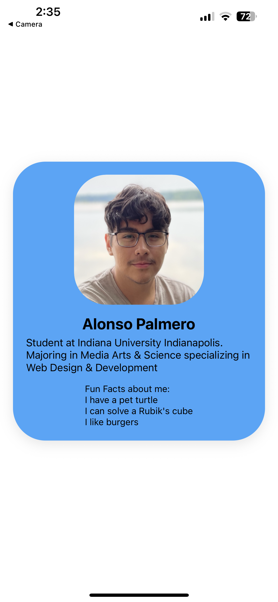

# named-profile-card

This is an Expo Go project. The purpose of this application is to display a profile card detailing some information about me

## To run this application:

> To run this application, ensure you have to following prerequisites installed:
>
> - [Node.js](https://nodejs.org/en) to use `npm`
> - Visual Studio Code
> - Expo Go on a mobile device

1. Open the project in Visual Studio Code

2. Open a terminal in Visual Studio Code

3. Run the following command in the Visual Studio Code terminal:

```
 npx expo start
```

4. Scan the QR code with a mobile device with Expo Go installed.

The application should now run

## Screenshot of application running:


